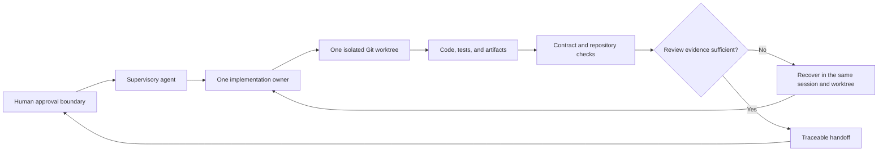

# Verifiable Agent Development Framework

**Multi-Agent Orchestration, Evidence References, Recovery, and QA**

This repository is a sanitized reference implementation for supervised software-development handoffs.
A supervisory agent decomposes work and inspects artifacts, while one implementation owner works inside one isolated Git worktree.
A deterministic validator checks whether a handoff manifest is structurally consistent and reviewable.

## What is public, policy, and private

Three boundaries matter when reading this repository.

- **Public implemented code:** the Python validator, CLI, examples, tests, publication checks, link checks, and CI configuration are present and inspectable here.
- **Architectural policy:** the role model, worktree ownership rule, recovery procedure, evidence-reference rules, and transactional PDF QA flow are documented policies, but not every policy has a corresponding runtime component in this repository.
- **Private case-study context:** Hermes, Pi, rpiv, and the resume-optimizer scenario explain the source architecture, but the private system, private artifacts, and application history are not public evidence and are not reproduced here.

## The problem

Coding agents can produce useful changes, but a completion message does not prove that the right files changed, commands ran, outcomes are accurate, privacy review occurred, or evidence references support a claim.
Parallel work also becomes risky when ownership, worktrees, artifacts, and recovery state are implicit.

## The system

The framework separates four responsibilities.

1. A human sets the objective, approval boundaries, and release decision.
2. A supervisory agent decomposes the objective, monitors launches, inspects artifacts, and requests independent review.
3. An implementation owner edits and tests one isolated worktree.
4. Deterministic tools check manifest structure, links, publication rules, and testable repository behavior.

The case-study terminology maps Hermes to supervision and Pi with rpiv to implementation workflows.
Those names are contextual labels rather than prerequisites for understanding or running the public code.
See the [implementation glossary](docs/implementation-glossary.md) for the mapping and its limits.

## Workflow



A handoff records the worker handle, worktree, changed artifacts, verification-command attestations, recorded outcomes, claim statuses, evidence references, recovery state, privacy-review attestations, and remaining risks.
The included validator rejects duplicate JSON keys, malformed input, failed recorded statuses, ambiguous ownership, unsafe paths, inconsistent evidence references, and blocked claims marked for output.

> **Attestation boundary:** the validator does not execute manifest commands, reproduce recorded outcomes, inspect the referenced evidence content, or independently perform the recorded privacy review.
> A `CONTRACT VALID` result means the manifest satisfies the structural contract, not that its attestations are true.

## Inspectable repository evidence

Everything in this table can be examined directly in this repository.

| Evidence | Where to inspect |
| --- | --- |
| Deterministic handoff contract | [`vadf/validator.py`](vadf/validator.py) |
| Duplicate-key and UTF-8 input handling | [`vadf/cli.py`](vadf/cli.py) |
| Accepted and rejected manifests | [`examples/`](examples/) |
| Validator and CLI regression tests | [`tests/test_validator.py`](tests/test_validator.py) |
| Publication-check failure fixtures | [`tests/test_publication_rules.py`](tests/test_publication_rules.py) |
| Git-derived publication scanner | [`scripts/check_publication_rules.py`](scripts/check_publication_rules.py) |
| Local Markdown link checker | [`scripts/check_markdown_links.py`](scripts/check_markdown_links.py) |
| Secret-free CI command configuration | [`.github/workflows/ci.yml`](.github/workflows/ci.yml) |

No private metrics, application-history claims, benchmark results, or production claims are used as public evidence.

## Quick start

The reference implementation requires Python 3.10 or newer and uses only the standard library at runtime.

```bash
python3 -m unittest discover -s tests -v
python3 -m vadf validate examples/verified_handoff.json
python3 -m vadf validate examples/invalid_handoff.json
python3 scripts/check_markdown_links.py
python3 scripts/check_publication_rules.py
```

The accepted example returns exit code `0` and prints `CONTRACT VALID` plus an attestation notice.
A readable manifest that violates the structural contract returns exit code `1`.
An unreadable file, malformed JSON, duplicate JSON object key, or non-UTF-8 input returns exit code `2`.

## Architecture

The core invariant is simple: one implementation owner controls one worktree for the duration of a change.
The supervisory layer can coordinate and inspect multiple efforts, but it does not permit concurrent writers inside the same worktree.
Durable memory, reusable skills, repository instructions, task artifacts, and session history remain separate state surfaces with different retention and review rules.

Read [Architecture](docs/architecture.md) for role boundaries, state boundaries, recovery, and the trust model.
Read [Manifest contract](docs/manifest-contract.md) for deterministic validation and attestation rules.

## Limits

This repository does not reproduce the private operating environment or resume-optimizer implementation.
It contains no private prompts, messages, memory, credentials, contacts, proprietary code, or personal resume data.
It does not claim measured development speed, defect reduction, cost savings, accuracy gains, hiring outcomes, production deployment, users, revenue, or benchmark performance.
The validator checks syntax, structure, cross-references, and status consistency.
It does not prove semantic truth, execute recorded commands, verify external evidence, or replace human review.
The publication scanner uses bounded high-risk patterns and is not a comprehensive secret scanner.
Human review remains the final approval boundary.

## Documentation

- [Architecture](docs/architecture.md)
- [Resume optimizer policy case study](docs/case-study.md)
- [Implementation glossary](docs/implementation-glossary.md)
- [Manifest contract](docs/manifest-contract.md)
- [Examples learning path](examples/README.md)
- [Contributing](CONTRIBUTING.md)
- [Security](SECURITY.md)

## License

The source and documentation in this sanitized reference repository are available under the [MIT License](LICENSE).
