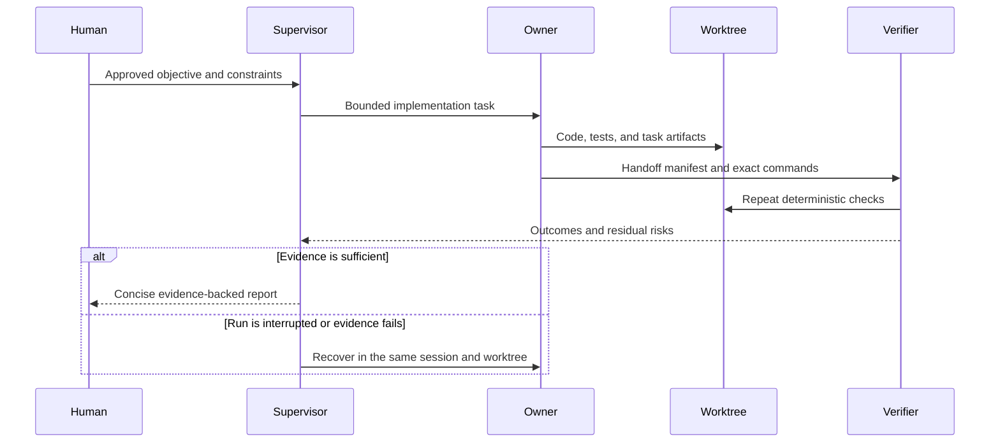

# Architecture

## Scope

The Verifiable Agent Development Framework is a supervised coordination pattern for software changes that need explicit ownership, inspectable evidence references, recoverable execution, and bounded claims.
This repository implements a deterministic handoff validator, test suite, publication checker, link checker, examples, and CI configuration.
The role model, recovery flow, and transactional artifact policies are documented architecture rather than fully implemented orchestration code.
The private source environment and its application history are not part of the public evidence surface.

## Role boundaries

| Role | Responsibilities | Explicit boundary |
| --- | --- | --- |
| Human approver | Objective definition, sensitive-action approval, evidence review, and acceptance or release decisions | Final authority over acceptance and release |
| Supervisory agent | Work decomposition, launch monitoring, artifact inspection, independent-check requests, and concise reporting | No silent expansion of approval scope and no concurrent writers in one worktree |
| Implementation owner | File changes, local checks, artifact records, and handoff preparation | One writer in one isolated worktree at a time |
| Independent verifier | Repeated or audited checks against the changed surface | Evidence evaluation separate from the implementation owner's completion narrative |
| Deterministic tooling | Manifest validation, tests, link checks, and machine-observable outcomes | Contract validation without substituting for product judgment |

The supervisory agent and implementation owner are separate logical roles even when one person or one runtime initiates both.
This separation makes launch decisions, write ownership, and evidence review explicit.

## Control flow

## Worktree ownership invariant

A worktree has one implementation owner for the active change.
The manifest records an opaque worker handle, a sanitized repository-relative worktree identifier, and an `exclusive` flag.
The validator requires `exclusive` to be `true`.
This invariant avoids merge-like conflicts inside an active worktree and makes recovery ownership clear.

The framework can coordinate multiple worktrees, but each worktree keeps its own owner, artifacts, and verification record.
Coordination does not imply unrestricted agent autonomy.

## State boundaries

| State surface | Purpose | Retention and review rule |
| --- | --- | --- |
| Durable memory | Stable preferences and approved lessons with cross-task value | Selective storage and freshness review before reuse |
| Reusable skills | Versioned procedures for recurring work | Separation from project facts and validation before enablement |
| Repository instructions | Local commands, architecture constraints, and privacy rules | Repository-local authority for implementation work |
| Task artifacts | Plans, designs, reviews, handoffs, and check evidence for one effort | Task-scoped retention and sanitization before public use |
| Session history | Conversational context and execution history | Recovery and traceability support rather than current-project authority |

The boundaries prevent a temporary task detail from becoming durable memory by accident.
They also prevent repository-specific instructions from being hidden inside a private conversation.

## Handoff contract

A contract-valid handoff contains these top-level records.

- `implementation_owner` identifies the logical owner and isolated worktree.
- `artifacts` lists identified repository-relative files with kinds, statuses, and descriptions.
- `verification` records exact command strings, attested outcomes, and human-readable evidence statements.
- `claims` marks each claim as `supported`, `limited`, or `blocked`.
- `residual_risks` records what remains open, accepted, or mitigated.
- `recovery` records whether same-session and same-worktree recovery was used.
- `privacy_review` records an attestation that the public artifact was reviewed for sensitive content.

The validator does not execute recorded commands, reproduce outcomes, inspect referenced evidence content, or independently perform the recorded privacy review.
It checks the shape, allowed values, cross-references, and status consistency of those attestations.
The validator rejects unknown fields so schema drift is visible.
It also reports every detected error in stable traversal order rather than stopping at the first failure.
See the [manifest contract](manifest-contract.md) for field-level rules.

## Evidence-reference and status boundary

A supported claim needs at least one evidence reference.
A limited claim needs an explicit limitation.
A blocked claim must not be marked as included in output.
Artifact and check references must resolve to identifiers declared in the same manifest.
Path references must use a safe repository-relative form.

The gate validates reference shape, reference resolution, status consistency, and limitation presence.
It does not determine whether the referenced material semantically proves the claim.
That semantic review remains a human and verifier responsibility.

## Recovery

Interrupted or failed work resumes under the same logical owner and inside the same worktree when the worktree remains usable.
The supervisor first inspects repository state and existing artifacts, then continues from the last verified point.
A recovery record distinguishes a recovered run from work that did not require recovery.

Same-worktree recovery preserves the relationship among file changes, test output, and task artifacts.
If the worktree is corrupted or ownership cannot be established, the safe action is to stop and create a new explicitly owned effort rather than silently switching context.

## Trust model and limitations

Repository test commands provide evidence only when a reviewer actually runs them and inspects the outcome.
Manifest command strings and recorded outcomes are author attestations until independently repeated.
The framework treats repository instructions as local policy after they are inspected.
It treats agent summaries as navigation aids that require artifact or command evidence.
It treats public documentation as a sanitized representation rather than evidence of a private source system.

Human approval is required for release, external side effects, sensitive data handling, and acceptance of residual risk.
No component is described as operating outside those approval boundaries.
